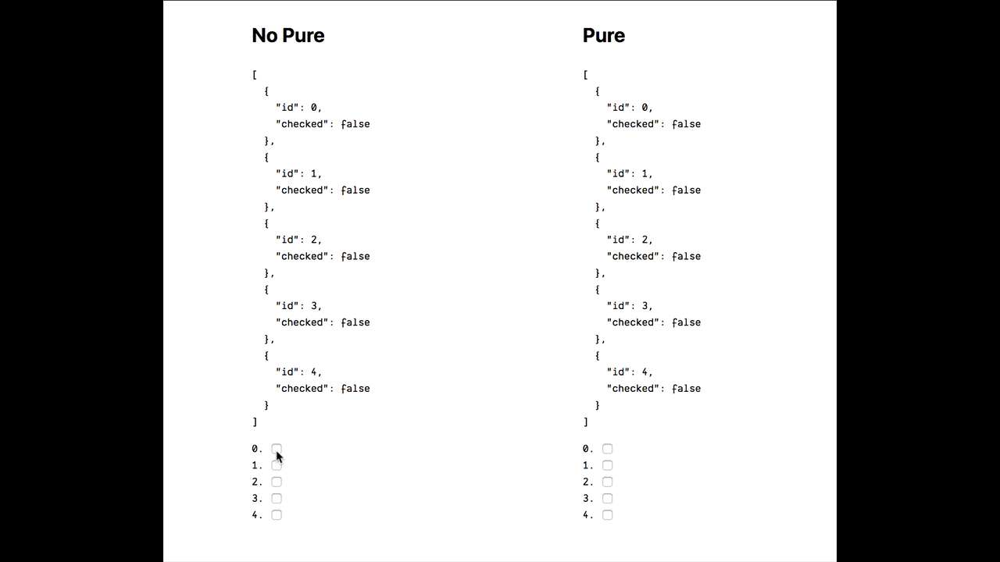

<h1 align="center">
  
  <p>react-dev-memo</p>
  <a href="https://circleci.com/gh/rwu823/react-dev-memo" alt="Build Status">
    
  </a>
</h1>

<p align="center">
  <a href="https://www.npmjs.org/package/react-dev-memo">
    
  </a>
  <a href="https://codecov.io/github/rwu823/react-dev-memo">
    
  </a>
  
</p>

<h4 align="center">
  <sub>Material ripple effect, ripples everywhere</sub>
</h4>

<h3 align="center">
  <a href="https://rwu823.github.io/react-dev-memo">Live Demo</a>
</h3>

## Screen



## Story
In these recent days, React team released a new [devtool](https://reactjs.org/blog/2019/08/15/new-react-devtools.html) version it's awesome and more efficiently but loss `highlight update` 😢. When we're developing a pure component and the one important thing is how to make sure our component is really pure. So that is why `react-dev-memo` is created.


## Installation

```sh
yarn add react-dev-memo
```
Installs without `--dev` because it's able to work on production.

## Usage

```diff
import React from 'react'
+ import devMemo from 'react-dev-memo'

- const PureComponent = ({ name, age }) => <div />
+ const PureComponent = ({ name, age, ...props }) => <div {...props} />


- export default React.memo(PureComponent, (prevProps, nextProps) => prevProps.name === nextProps.name && prevProps.age === nextProps.age)
+ export default devMemo(PureComponent, ['name', 'age'])
```

### Injected style props
And the highlighted styles inject `style` props into your component:

```diff
import devMemo from 'react-dev-memo'

- const PureComponent = () => <div />
+ const PureComponent = props => <div {...props} />

export default devMemo(PureComponent)
```

## Options

```ts
export interface DevMemoOptions {
  /** display highlight */
  highlight: boolean

  /** display console */
  console: boolean

  /** set outline style */
  outline: string

  /** set highlight duration time */
  duration: number
}
```
